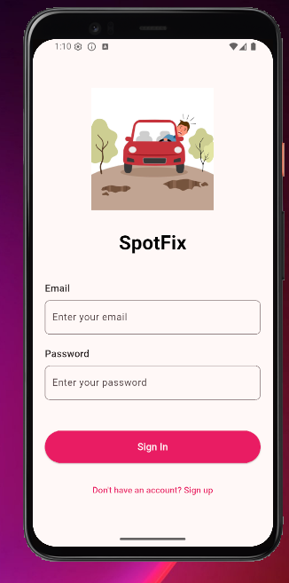

# 🌟 SpotFix - Community Issue Reporting Platform

SpotFix is a comprehensive solution that connects citizens with local government to report and resolve community issues efficiently. The platform consists of a mobile app for citizens and an admin panel for government officials.

Empowering communities to create cleaner, safer environments

## 📱 Mobile App

The SpotFix mobile app allows citizens to report local issues with photos and location data.

### Features

- 📸 One-tap issue reporting with photo uploads
- 🔄 Real-time status tracking
- 🗺️ Location-based issue mapping
- 🔔 Push notifications for updates
- 👤 User authentication and profile management

### Screenshots

<div align="center"> 
 
  
    
     
        
    
    
    
   
     
 </div>
### Running the Mobile App

1. Clone this repository

   ```
   git clone https://github.com/yourusername/spotfix.git
   ```

2. Navigate to the app directory

   ```
   cd spotfix/app
   ```

3. Install dependencies

   ```
   flutter pub get
   ```

4. Run the app

   ```
   flutter run
   ```

5. For release build
   ```
   flutter build apk --release
   ```

## 💻 Admin Panel

The SpotFix admin panel allows government officials to manage and respond to reported issues.

### Features

- 📊 Comprehensive dashboard with issue statistics
- 📋 Issue management workflow
- 🔄 Status update system
- 👥 User management
- 📈 Analytics and reporting

### Screenshots

### Running the Admin Panel

1. Navigate to the admin directory

   ```
   cd spotfix/admin
   ```

2. Install dependencies

   ```
   npm install
   ```

3. Run the development server

   ```
   npm run dev
   ```

4. Build for production

   ```
   npm run build
   ```

5. Start the production server
   ```
   npm start
   ```

## 🛠️ Technologies Used

### Mobile App

- Flutter & Dart
- Supabase for backend
- Shared Preferences for local storage

### Admin Panel

- Next.js 14
- React
- Tailwind CSS
- Supabase

## 📊 Project Structure

```
spotfix/
├── app/                 # Flutter mobile application
│   ├── lib/             # Dart source code
│   │   ├── models/      # Data models
│   │   ├── screens/     # UI screens
│   │   ├── services/    # API services
│   │   └── widgets/     # Reusable widgets
│   ├── assets/          # Images and other assets
│   └── ...
│
├── admin/               # Next.js admin dashboard
│   ├── app/             # Next.js app directory
│   ├── components/      # React components
│   ├── utils/           # Utility functions
│   └── ...
│
└── README.md            # This file
```

## 🚀 Deployment

### Mobile App

The mobile app can be deployed to the Google Play Store and Apple App Store.

### Admin Panel

The admin panel can be deployed to Vercel with the following command:

```
vercel
```

## 🔑 Environment Setup

### Admin Panel

Create a `.env.local` file in the admin directory with the following variables:

```
NEXT_PUBLIC_SUPABASE_URL=your_supabase_url
NEXT_PUBLIC_SUPABASE_ANON_KEY=your_supabase_anon_key
```

## 📄 License

Developed with ❤️ by AstroSoft
© 2025 SpotFix. All rights reserved.

---
